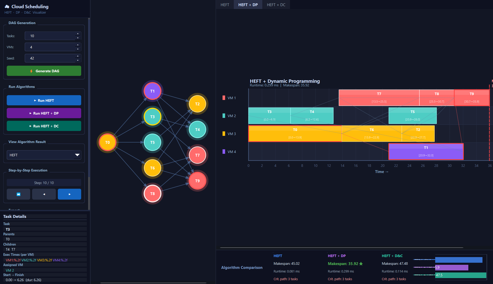

# 🚀 HEFT Task Scheduling Visualizer

[](https://isocpp.org/)
[](https://www.qt.io/)
[](https://cmake.org/)

An interactive visualization suite for analyzing and comparing Directed Acyclic Graph (DAG) task scheduling algorithms in heterogeneous cloud computing environments. This tool provides a side-by-side performance analysis of three advanced scheduling heuristics.

---

## 🖼️ Application Gallery

### Core Interface & Algorithm Comparison
The application features a multi-panel layout including a dynamic Control Panel, Interactive DAG Scene, and an Algorithm Comparison Dashboard.

<p align="center">
  
</p>

---

## 🌟 Overview

The visualizer implements three distinct variants of the **Heterogeneous Earliest Finish Time (HEFT)** algorithm, designed to optimize task mapping across Virtual Machines (VMs) with non-uniform computational capacities.

1.  **Standard HEFT** – The industry-standard greedy heuristic using upward-rank prioritization.
2.  **HEFT + Dynamic Programming** – Enhanced prioritization via bilateral ranking combined with global DP state optimization.
3.  **HEFT + Divide & Conquer** – A parallel-friendly approach using topological level clustering and communication-aware merging.

---

## ✨ Key Features

*   **Dynamic DAG Engine** – Generate random task graphs (4–30 nodes) and VM clusters (2–8 nodes) with seed-based reproducibility.
*   **Dual Visualization Modes**:
    *   **Graph View**: Interactive task dependencies with node coloring based on VM assignment.
    *   **Gantt View**: High-fidelity timeline rendering with dependency overlays and critical path tracking.
*   **Intelligent Analysis** – Real-time calculation of **Makespan**, algorithm **Runtime**, and **Critical Path** length.
*   **Stepped Simulation** – Execute schedules incrementally to observe the decision-making process of each heuristic.
*   **Data Portability** – Export visual Gantt charts as PNG or comprehensive scheduling metadata as CSV.

---

## 🏗️ System Architecture

The project follows a modular architecture to separate core scheduling logic from the graphical presentation layer.

| Layer | Responsibility |
| :--- | :--- |
| **Algorithm Engine** | Implementation of HEFT variants and ranking logic. |
| **Visual Scenes** | Custom Qt Graphics Scenes for the DAG and Gantt chart rendering. |
| **Orchestration** | Main Window management and signal/slot communication between UI panels. |
| **Data Models** | Definitions for DAG structures, Task metadata, and VM performance matrices. |

### 📁 Project Structure
```text
src/
├── AlgorithmEngine.cpp  # Core HEFT, DP, and D&C logic
├── DagScene.cpp         # Interactive Graph visualization
├── GanttScene.cpp       # Timeline rendering engine
├── DataTypes.h          # Global structures and enums
└── MainWindow.cpp       # UI orchestration and view management
```

---

## 🛠️ Technical Stack

*   **Language:** C++17
*   **GUI Framework:** Qt 6 (Widgets & GraphicsView)
*   **Build System:** CMake 3.16+
*   **Platform Support:** Windows (MSVC), macOS (Clang), Linux (GCC)

---

## 🚀 Getting Started

### Prerequisites
*   Qt 6.x installed with the Widgets module.
*   A C++17 compatible compiler.

### Build Instructions
```bash
# 1. Clone the repository
git clone https://github.com/yourusername/heft-scheduler-visualizer.git
cd heft-scheduler-visualizer

# 2. Create build artifacts
mkdir build && cd build
cmake ..
cmake --build . --config Release

# 3. Launch
./HEFTVisualizer
```

---

## 📊 Performance Analytics

Typical results for a medium-complexity DAG (15 Tasks, 4 VMs):

| Heuristic | Makespan (Efficiency) | Runtime (Latency) | Complexity |
| :--- | :--- | :--- | :--- |
| **Standard HEFT** | Baseline | Very Fast | $O(n^2 \cdot m)$ |
| **HEFT + DP** | **Superior** | Moderate | $O(n \cdot m^2)$ |
| **HEFT + D&C** | Balanced | **Fastest** | $O(n \cdot m)$ |

*Note: The DP variant typically minimizes makespan but requires higher computational overhead.*


